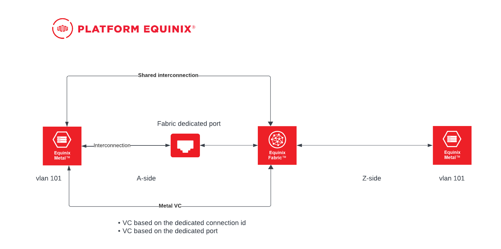

# Metal to Fabric to Metal
Connect two Metal locations via Fabric

> Please note that this demo/code doesn't follow the best practices recommended by the Equinix

## Table of Contents
- [Pre-requirement](#pre-requirements)
- [Architecture](#architecture)
- [Inputs](#inputs)
- [Usage](#usage)
- [Outputs](#outputs)

## Pre-requirements

↥ [back to top](#table-of-contents)

- [Terraform](https://www.terraform.io/downloads.html)
- [Vagrant](https://www.vagrantup.com/downloads)
- [Equinix Metal](https://console.equinix.com/)
- [Equinix Fabric Account](https://fabric.equinix.com/)
- [Equinix Fabric API authentication](https://developer.equinix.com/)

Setup the authentication, we will need three environment variables. You can [read](https://registry.terraform.io/providers/equinix/equinix/latest/docs) on how to setup authentication.

```bash
export EQUINIX_API_CLIENTID=someEquinixAPIClientID
export EQUINIX_API_CLIENTSECRET=someEquinixAPIClientSecret
export METAL_AUTH_TOKEN=someEquinixMetalToken
```

## Architecture


## Inputs

↥ [back to top](#table-of-contents)

Use `terraform.tfvars-example` to populate all required variables for the terraform code.

The variables in this file needs to be with all the correct values

```bash
project_id = ""

metal_cluster = {
  "dallas" = {
    plan             = "m3.small.x86"
    metro            = "da"
    operating_system = "ubuntu_22_04"
    billing_cycle    = "hourly"
    vxlan            = 1005
    network_type     = "hybrid-bonded"
    port_name        = "bond0"
    ip               = "192.168.105.101"
    netmask          = "255.255.255.0"
  },
  "amsterdam" = {
    plan             = "m3.small.x86"
    metro            = "am"
    operating_system = "ubuntu_22_04"
    billing_cycle    = "hourly"
    vxlan            = 1005
    network_type     = "hybrid-bonded"
    port_name        = "bond0"
    ip               = "192.168.105.102"
    netmask          = "255.255.255.0"    
  }
}

dedicated_port_uuid = ""
metro_a = "DA"
metro_z = "AM"
vxlan = 1005
dedicated_fabric_connection_uuid = "" // existing of the dedicated port
dedicated_port_id = "" // existing of the primary dedicated port
```

## Usage

↥ [back to top](#table-of-contents)

Clone the repository

```bash
git clone git@github.com:eqix-use-cases/metal-fabric-metal.git
cd metal-fabric-metal
```

Run apply

```bash
terraform apply
```

Once you need to remove the infrastructure

```bash
terraform destroy
```

## Outputs

↥ [back to top](#table-of-contents)